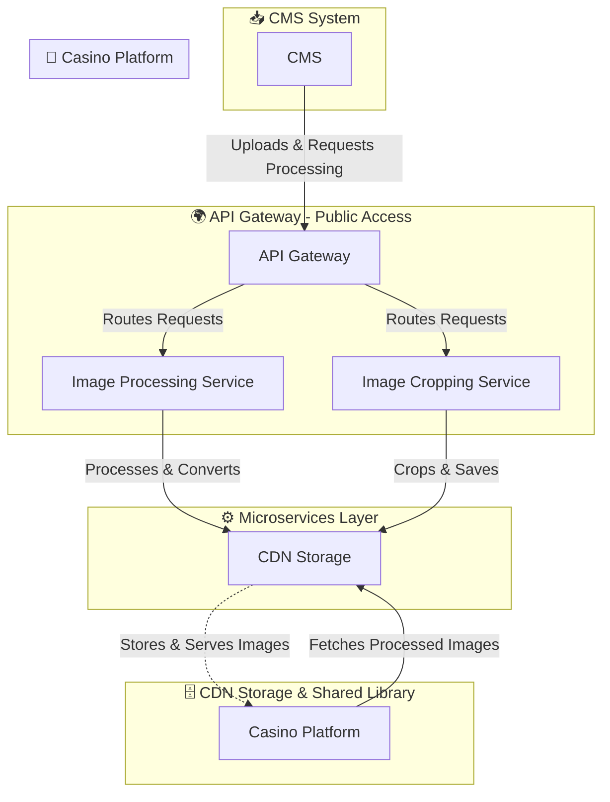

## 📊 Architecture Diagram

```mermaid
flowchart TD
    subgraph API Gateway [🌍 API Gateway - Public Access]
        A[API Gateway] -->|Routes Requests| B(Image Processing Service)
        A -->|Routes Requests| C(Image Cropping Service)
    end

    subgraph Microservices [⚙️ Microservices Layer]
        B[Image Processing Service] -->|Processes & Converts| D[CDN Storage]
        C[Image Cropping Service] -->|Crops & Saves| D[CDN Storage]
    end

    subgraph CDN & Storage [🗄️ CDN Storage & Shared Library]
        D[CDN Storage] -.->|Stores & Serves Images| H[Casino Platform]
    end

    subgraph CMS System [📥 CMS System]
        F[CMS] -->|Uploads & Requests Processing| A
    end

    subgraph Casino Platform [🎰 Casino Platform]
        H[Casino Platform] -->|Fetches Processed Images| D
    end
```
