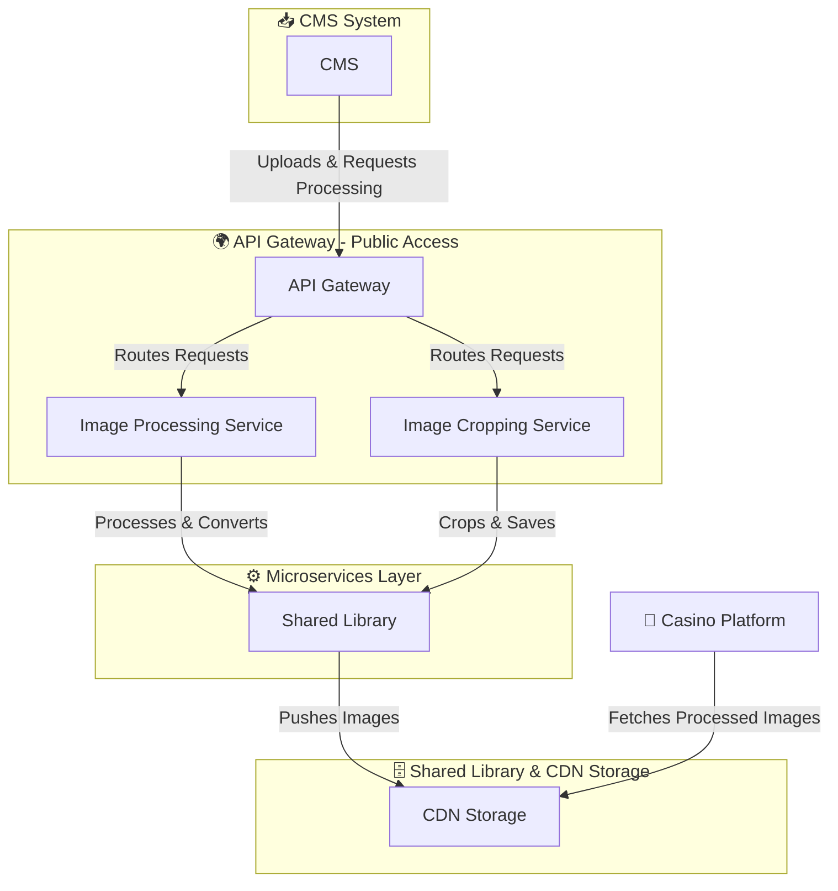

## 📊 Architecture Diagram

```mermaid
flowchart TD
    subgraph API Gateway [🌍 API Gateway - Public Access]
        A[API Gateway] -->|Routes Requests| B[Image Processing Service]
        A -->|Routes Requests| C[Image Cropping Service]
    end

    subgraph Microservices [⚙️ Microservices Layer]
        B[Image Processing Service] -->|Processes & Converts| D[Shared Library]
        C[Image Cropping Service] -->|Crops & Saves| D[Shared Library]
    end

    subgraph Shared Library & CDN [🗄️ Shared Library & CDN Storage]
        D[Shared Library] -->|Pushes Images| E[CDN Storage]
    end

    subgraph CMS System [📥 CMS System]
        F[CMS] -->|Uploads & Requests Processing| A
    end

    H[🎰 Casino Platform] -->|Fetches Processed Images| E[CDN Storage]
```

